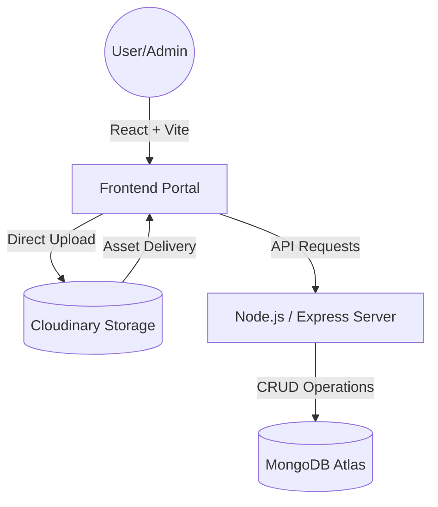

# 📰 JG-NEWS-Plus: Professional News Portal & E-Newspaper System

[](https://vercel.com)
[](https://reactjs.org/)
[](https://nodejs.org/)
[](https://cloudinary.com/)

**JG-NEWS-Plus** is a high-performance, professional-grade news management system and digital E-Newspaper platform. Built for speed, reliability, and modern aesthetics, it features a seamless integration between a powerful administrative backend and a fast, visually stunning frontend.

---

## ✨ Key Features

### 🗞️ Professional E-Newspaper Reader
- **In-Website Viewing:** Read PDFs directly in the browser with our custom `react-pdf` engine. No redirects, no downloads required.
- **Advanced Controls:** Zoom in/out, full-screen mode, keyboard navigation, and responsive width for mobile devices.
- **Hindi Support:** Fully optimized for Devanagari text rendering with custom `cMap` integration.

### ☁️ Scalable Media Management
- **Direct Cloudinary Upload:** Large PDF files (E-Newspapers) bypass backend streaming limits by uploading directly from the browser to Cloudinary.
- **Lightning Fast:** Optimized image and PDF delivery via Global CDN.
- **Secure Architecture:** Uses unsigned upload presets for reliable high-speed transfers.

### 🛠️ Powerful Admin Dashboard
- **Dynamic Content:** Create, edit, and delete news articles, categories, and live TV links in real-time.
- **User-Centric Management:** Easy-to-use interface for managing the entire portal without touching code.
- **Live TV Integration:** Stream your YouTube live feed directly onto the homepage with one click.

### ⚡ Performance & UX
- **Skeleton Loaders:** Professional pulsing animations during data fetching for an elite "premium" feel (no blank pages).
- **Dynamic Categories:** Seamlessly add new categories from the admin panel and watch them appear automatically in the Navbar and Home sections.
- **Responsive Design:** A mobile-first approach ensuring the news looks great on phones, tablets, and desktops.

---

## 🚀 Tech Stack

- **Frontend:** React.js, Vite, Tailwind-inspired Vanilla CSS, Context API.
- **Backend:** Node.js, Express.js.
- **Database:** MongoDB (Mongoose).
- **Storage:** Cloudinary (Media/PDFs).
- **Deployment:** Vercel.

---

## 🏗️ System Architecture



---

## 📂 Project Structure

```text
├── backend/
│   ├── models/        # Mongoose database schemas
│   ├── routes/        # API endpoints (News, Newspaper, Category, etc.)
│   └── server.js      # Main Express entry point
├── src/
│   ├── admin/         # Administrative Panel components
│   ├── components/    # Reusable UI components (PDFViewer, Skeletons, etc.)
│   ├── context/       # State management (NewsContext, LangContext)
│   ├── pages/         # Frontend pages (Home, Category, EPaper, etc.)
│   ├── store/         # API service logic and axios instances
│   └── utils/         # Helper functions and constants
├── public/            # Static assets (logo, icons, etc.)
└── index.css          # Professional Global Design System
```

---

## 🔑 Admin Access

Access the power-user dashboard to manage your news portal:
- **Route:** `/login` or your defined admin entry point.
- **Features:** Article creation, PDF uploading, Live TV stream updates, and Category management.

---

## 🛠️ Installation & Setup

### 1. Clone the repository
```bash
git clone https://github.com/The-CyberGenius/JG-NEWS-Plus.git
cd JG-NEWS-Plus
```

### 2. Environment Variables
Create a `.env` file in the root directory:
```env
MONGO_URI=your_mongodb_connection_string
CLOUDINARY_CLOUD_NAME=your_cloud_name
CLOUDINARY_API_KEY=your_api_key
CLOUDINARY_API_SECRET=your_api_secret
ADMIN_PASSWORD=your_dashboard_password
```

### 3. Install Dependencies
```bash
# Install frontend & root dependencies
npm install

# Install backend dependencies
cd backend
npm install
cd ..
```

### 4. Run Locally
```bash
# In Terminal 1 (Frontend)
npm run dev

# In Terminal 2 (Backend Server)
npm run dev:server
```

---

## 💡 Important Notes

- **Cloudinary Setup:** Ensure you have created an **Unsigned Upload Preset** named `jgnews_pdf` in your Cloudinary Dashboard and enabled "Allow delivery of PDF and ZIP files" in Security settings.
- **Deployment:** The project is optimized for **Vercel**. Simply connect your GitHub repo and add the Env variables in the Vercel dashboard.

---

## 🗺️ Roadmap
- [x] Integrate Professional PDF Viewer
- [x] Direct Cloudinary Upload Logic
- [x] Dynamic Categories & Navbar
- [x] Professional Skeleton UI
- [ ] Multi-language Support Refinement
- [ ] Push Notifications for Breaking News

---

## 🤝 Contributing
Contributions are welcome! Feel free to open issues or submit pull requests to improve the platform.

**Developed with ❤️ by Shiva Prajapat**
